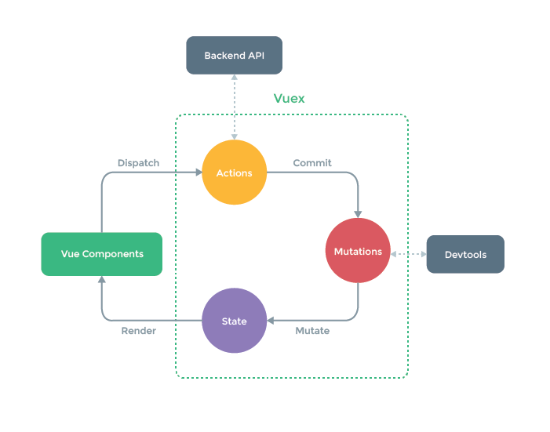

[TOC]

# Vuex

## 了解Vuex

Vuex是一个专门为Vue.js应用程序开发的全局状态管理模式, 它采用集中式存储管理所有组件的公共状态, 并以相应的规则保证状态以一种可预测的方式发生变化

### 为什么要使用Vuex

vue组件是Vue最强大的功能之一，所以要掌握Vue，组件间的通信是必须掌握的技能，但如果你使用 vue.js 开发过大型项目, 那么我想你可能会对 vue 组件之间的通信感到崩溃 。
>vuex的出现就是为了解决多组件间的数据通讯（下图为：Vuex的核心工作原理）




## 使用

### 步骤
1. 引入
2. 安装插件
3. 实例化store
4. 将store实例注入到Vue根实例
5. 在组件中使用


```javascript
    import Vue from 'vue'
    // 1. 引入
    import Vuex from 'vuex'、

    // 2. 安装插件
    Vue.use(Vuex)

    // 3.创建store
    const store = new Vuex.Store({
        // 配置核心参数
        state:{
            products:[
                {name: '鼠标', price: 20},
                {name: '键盘', price: 40},
                {name: '耳机', price: 60},
                {name: '显示屏', price: 80}
            ]
        }
    }

    let app = new Vue({
        el:'#app',
        template:`<myapp/>`,
        components:{ myapp },

        // 4. store注入到vue实例
        store
    });

    // 5. 在myapp组件中使用
    this.$store.state.products
```

### Vuex的核心配置

* state
    > state就是Vuex中的公共的状态, 用于保存所有组件的公共数据，类似于组件中的`data`
    * 获取：`this.$store.state.xxx`

    ```javascript
        state:{
            products:[
                {id:1, name: '鼠标', price: 20},
                {id:2, name: '键盘', price: 40},
                {id:3, name: '耳机', price: 60},
                {id:4, name: '显示屏', price: 80}
            ],
        },
    ```

* getters
    > 类似于组件中的`computed`，getter 的返回值会根据它的依赖被缓存起来，且只有当它的依赖值发生了改变才会被重新计算。
    * 获取：`this.$store.getters.xxx`

    ```javascript
        getters:{
            saleProducts(state){
                return state.products.map(item=>{
                    return {
                        price:item.price/2,
                        name:item.name
                    }
                });
            }
        },
    ```

* mutations
    > 修改state的唯一方式，类似于组件中的methods
    - mutation参数
        + state
        + payload 触发函数时传入的参数（只允许传递一下参数）
    * 调用方式：`this.$store.commit(type,payload)`

    ```javascript
        mutations:{
            // 定义
            change(state,payload){
                state.products = state.products.map(item=>{
                    return {...item,...payload};
                });
            }
        }

        // 调用
        this.$store.commit('change',{price:88})
    ```

* actions 
    > 类似于 mutations，负责异步操作（actions中可以包含异步操作, mutations中绝对不允许出现异步），actions用来操作mutations，而mutations用来操作state

    * action参数
        - context： 与store实例具有相同属性和方法的对象
        - payload 触发函数时传入的参数
    * 调用方式：`this.$store.dispatch(type,payload)`

    ```javascript
        actions:{ 
            // 定义
            minusPriceAsync( context, payload ) {
                setTimeout( () => {
                    context.commit( 'change', payload ); //context提交
                }, 2000)
            }
        }

        // 调用
        this.$store.dispatch('minusPriceAsync',{price:100})
    ```

### store模块化

由于使用单一状态state（即所有状态会集中到state这个对象），当应用变得非常复杂时，store 对象就有可能变得相当臃肿。为了解决以上问题，Vuex 允许我们将 store 分割成模块（module）。每个模块拥有自己的 state、mutation、action、getter等，这样好管理又容易维护，模块化后，默认只影响state的获取，getters,mutations,actions还是保存在全局状态

* 模块内部的 mutation 和 getter，接收的第一个参数state是模块的局部状态对象
* action中
    * context.state 局部状态
    * context.rootState 全局状态

```javascript
    import Vue from 'vue';
    import Vux from 'vuex';

    // 引入其他store模块
    import home from './home.js';
    import top250 from './top250.js';

    export default new Vuex.Store({
        modules:{
            home,
            top250
        }
    });

    // home.js
    const home = {
        state:{
            numbers:[10,6,3,9,12,18,5]
        },
        getters:{
            small(state){
                return state.numbers.filter(item=>item<10)
            }
        },
        mutations:{

        }
    }
    export default home
```
* namespace命名空间
    > namespaced:true，设置命名空间后让getters,mutations,actions具有自己的命名空间


### 映射Vuex
> 使用mapState,mapGetters,mapMutations,mapActions把state,getters,mutations,actions映射到组件中使用，主要用于简化操作

```javascript
    // 模块化开发中直接引入mapState使用
    import {mapState,mapGetters,mapMutations,mapActions} from 'vuex';

    computed:{
        // 数组形式
        ...mapState([
            'products' //映射computed.products为this.$store.state.products
        ]),
        // 对象形式
        ...mapState({
            // products:'products',
            // products:state=>state.products,
            products(state){
                return state.products;
            }
        })
    },
    methods:{
        // 数组形式
        ...mapMutations([
            'change',//映射this.change为this.$store.commit('change')
            ]),
        // 对象形式
        ...mapMutations({
            change2:'change',//映射this.change2为this.$store.commit('change')

            // 函数形式：
            change3:(commit,payload)=>{
                commit('change',payload);
            }
        }),
        ...mapActions({
            modify:'minusPriceAsync', //映射this.modify()为this.$store.dispatch('minusPriceAsync'),

            // 函数形式：自动传入dispatch，payload为调用,minus是传入的参数
            minus(dispatch,payload){
                dispatch('minusPriceAsync',payload)
            }
        })
    }
```